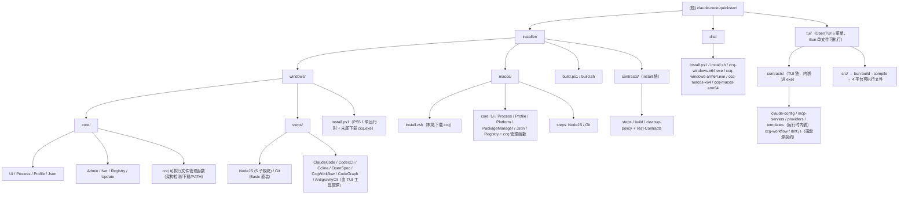

# claude-code-quickstart -- AI 上下文索引

> 生成时间：2026-06-19 | 最近更新：TUI 视图层空状态/加载状态统一重构（list-state 组件）

Windows 10/11 与 macOS 12+ 双平台的 **CLI Agent 开发环境自动化安装器**（当前支持 Claude Code / Codex 两个 Agent 上下文）。Windows 使用 **PS 5.1 单运行时**（前置检测内联 + winget 自动安装 + bootstrap Basic 两步直装，PS7 作为推荐组件非阻塞安装、不 re-exec），macOS 使用 zsh + Homebrew + nvm 原生入口；install 仅装 bootstrap Basic 两步（NodeJS / Git）并安装 `ccq`，Claude Code / Codex / 周边工具统一交给 Manage TUI「工具管理」按需安装、更新与卸载；Manage 为根级 **OpenTUI TUI + CLI 子命令子项目**（`tui/`，Bun `>=1.2.0`）**6 菜单**（工具管理 / 供应商 / 配置文件 / 全局规则 / MCP / Skills）+ content 顶部 `Claude Code` / `Codex` 全称 Header + 轻量命令行操作（`ccq cc <provider>` / `ccq cx [profile]` / `ccq ls [--tool claude|codex]` / `ccq use <provider> [--tool claude|codex]` / `ccq update` / `ccq tools update` / `ccq tools uninstall <name> [--yes|-y]` / `ccq uninstall [--yes|-y]`），通过 `bun build --compile` 交叉编译为 4 平台单文件可执行产物（`ccq-windows-x64.exe` / `ccq-windows-arm64.exe` / `ccq-macos-x64` / `ccq-macos-arm64`），ccq 经 PATH 目录天然可达（**不注入 Profile**），支持整可执行文件热更新；契约按「谁用归谁」拆分至 `installer/contracts/`（install 链）与 `tui/contracts/`（TUI 链，**内嵌进可执行文件**）。

---

## 架构速览

```
claude-code-quickstart/
├── dist/                             # 默认构建输出：6 个 artifact（2 .ps1 + 2 .sh + 4 平台 ccq 可执行文件）
├── tui/                              # 根级 OpenTUI TUI 子项目：6 菜单（工具管理/供应商/配置文件/全局规则/MCP/Skills）（src/ → 4 平台可执行文件）
│   └── contracts/                    # TUI 链契约：claude-config / mcp-servers / providers / templates（运行时内嵌）；ccg-workflow / claude-config-drift.js / templates/index.json 为磁盘源契约
└── installer/
    ├── build.ps1                     # Windows / GitHub Actions Windows job 构建入口（2 个 .ps1）
    ├── build.sh                      # macOS / Unix 构建入口（2 个 .sh artifact）
    ├── contracts/                    # install 链契约：steps / build / cleanup-policy + Test-Contracts.ps1
    ├── windows/
    │   ├── Install.ps1     # Windows PS 5.1+ 安装入口（前置检测内联 + Basic 两步 + 末尾确认下载 ccq 可执行文件）
    │   ├── core/                     # Windows PowerShell runtime core（含 ccq 可执行文件管理函数）
    │   └── steps/                    # Windows install 消费 NodeJS/Git；ClaudeCode 步骤文件仅历史保留
    └── macos/
        ├── Install.zsh     # macOS zsh 安装入口（前置检测内联 + Basic 两步 + 末尾确认下载 ccq 可执行文件）
        ├── core/                     # macOS zsh runtime core（含 ccq 可执行文件管理函数）
        └── steps/                    # macOS install 消费 NodeJS/Git
```



---

## 步骤依赖图

```
install 仅装 bootstrap Basic 两步：
NodeJS ─── Git
（ClaudeCode / CodexCli / Ccline / OpenSpec / CcgWorkflow / CodeGraph / AntigravityCli 等工具生命周期均由 Manage TUI「工具管理」按当前 Header 上下文承载）
```

---

## 模块导航

| 模块 | 详细文档 | 职责 |
|------|---------|------|
| tui/ | [tui/README.md](tui/README.md) | OpenTUI 6 菜单 TUI，Bun 单文件可执行分发（工具管理/供应商/配置文件/全局规则/MCP/Skills） |
| tui/contracts/ | [tui/AGENTS.md](tui/AGENTS.md#contracts-目录) | TUI 链契约：claude-config / mcp-servers / providers / templates（运行时内嵌）+ ccg-workflow / drift / templates index（磁盘源契约） |
| installer/ | [installer/README.md](installer/README.md) | Windows/macOS 安装器开发入口、平台目录、构建入口与契约边界 |
| installer/contracts/ | [installer/README.md](installer/README.md#契约边界) | install 链契约：steps.json 分组、build.json、cleanup-policy.json + Test-Contracts.ps1（Windows/macOS 共享） |
| installer/windows/ | [installer/AGENTS.md](installer/AGENTS.md) | Windows canonical 入口、core 与 steps |
| installer/windows/core/ | [installer/windows/core/AGENTS.md](installer/windows/core/AGENTS.md) | Windows PowerShell runtime core（含 Registry + ccq 可执行文件管理函数） |
| installer/windows/steps/ | [installer/windows/steps/AGENTS.md](installer/windows/steps/AGENTS.md) | Windows 9 个安装步骤模块（NodeJS 含 5 子模块；CcSwitch/CcgWorkflow/Mcp 已删） |
| installer/macos/ | [installer/README.md](installer/README.md) | macOS zsh Install、core（含 ccq 管理函数）与 9 个安装步骤 |

---

## 关键约束（HC）速查

| 约束 | 内容 |
|------|------|
| **HC-12** | 供应商配置（settings-compatible 单层格式）：每个 Profile 为 `~/.claude/providers/<文件名>.json`，**单层 `{ env }` 结构（无 `_meta`）**，env 含 `ANTHROPIC_AUTH_TOKEN` + `ANTHROPIC_BASE_URL` + 可选受管模型键（`ANTHROPIC_DEFAULT_HAIKU_MODEL` / `ANTHROPIC_DEFAULT_OPUS_MODEL` / `ANTHROPIC_DEFAULT_SONNET_MODEL`）+ 自由维护的额外 env（如 `ANTHROPIC_MODEL` / `CLAUDE_CODE_SUBAGENT_MODEL` / `CLAUDE_CODE_EFFORT_LEVEL` / `API_TIMEOUT_MS` / Kimi Coding Plan 的 `CLAUDE_CODE_AUTO_COMPACT_WINDOW=262144`）；**文件名 = 用户填写的英文名**（字母/数字/. _ -）。供应商管理完全经 **Manage TUI → 供应商管理**（迁移/CRUD/设置默认），**主安装不再含 ApiKey 步骤**；进入 Provider 视图自动迁移旧格式（含 `_meta`/`modelEnv`/`modelMapping`/`extraEnv`）为单层 env。Profile 即 settings-compatible，可经 `claude --settings ~/.claude/providers/<文件名>.json` 做 session 级覆盖（官方接受任意路径）；「设置默认」将 Profile.env 合并进 `~/.claude/settings.json`（严格字段所有权，不触碰 model/language/permissions/hooks/statusLine/outputStyle）。**注：mcpServers 不在 settings.json**（MCP 视图写 `~/.claude.json`），配置文件页仅剥离 model + 供应商 env（AUTH_TOKEN/BASE_URL/受管模型键），hooks/statusLine/outputStyle 等孤儿字段已在配置文件页放开（无专属视图接管，可直编）。ClaudeConfig 管常用配置：语言、权限、超时、归因等（仅补缺失，不覆盖），不写入 `model`（用户自行选择），并含 4 个 ccg-workflow 推荐配置 env（`CODEAGENT_POST_MESSAGE_DELAY` / `CODEX_TIMEOUT` / `BASH_DEFAULT_TIMEOUT_MS` / `BASH_MAX_TIMEOUT_MS`，作为推荐项 fill-missing 写入）；供应商支持 智谱GLM / MiniMax / Kimi Coding Plan / DeepSeek / 自定义 |
| **HC-4** | `$PROFILE` 编辑使用标记块 `# >>> Claude Code Quickstart >>>` / `# <<< Claude Code Quickstart <<<` |
| **HC-3** | 实时检测：每次运行都实时检测组件状态，无持久化状态文件 |
| **HC-13** | **PowerShell 数组安全**：`Set-StrictMode -Version Latest` 下，`$null.Count` 会抛异常。接收函数/cmdlet/管道返回值时**必须**用 `@()` 包裹以强制数组上下文（如 `$items = @(SomeFunction)`），禁止裸赋值后直接访问 `.Count`。返回数组的函数应使用 `return ,$array`（逗号阻止展开） |
| **HC-14** | **PS 版本约束（PS5.1 单运行时）**：`installer/windows/Install.ps1` 及其加载的 `windows/core` / `windows/steps` 模块**全部兼容 PS 5.1+**（前置检测内联，winget/PS7 自动安装为非阻塞推荐组件，**不 re-exec 到 pwsh**）；旧 `Bootstrap.ps1` / `Manage.ps1` 入口已删除。`core/Json.ps1` 提供 PS5.1 兼容的 `ConvertFrom-JsonToHashtable` 替代 PS7 `-AsHashtable`；源码 `.ps1` 统一 UTF-8 BOM；Windows Release `dist/install.ps1` 构建产物必须使用纯 ASCII trampoline（`installer/contracts/build.json` 的 `OutputEncoding` 固定为 `asciiTrampoline`），真实 UTF-8 脚本以 base64 内嵌并在本机用 `[Text.Encoding]::UTF8.GetString(...)` 还原执行，否则 PS5.1 在 `irm ... | iex` 读取 GitHub Release `application/octet-stream` 资产时会把 UTF-8 字节误解码为 Latin1/ANSI，BOM 也无法纠正；禁止 PS7 专有语法（`-AsHashtable` / `$PSStyle` / 三元 `?:` / `??` / `&&`/`||` 管道链 / `ForEach-Object -Parallel`） |
| **HC-15** | **Release 单文件 / `irm\|iex` 兼容约束**：`dist/*.ps1` 通过 `irm ... \| iex` 执行时没有稳定脚本文件上下文，`$PSScriptRoot` 为空；同时 PS5.1 对 GitHub Release asset 会误解码非 ASCII 内容，因此远程入口必须保持 ASCII trampoline，禁止改回直接输出 UTF-8 脚本。进入单文件 artifact 的 Windows 代码，在 `Join-Path` / `Test-Path` / `Get-Content` / dot-source / contracts 或 templates 查找前必须判空；路径不可用时走 inline fallback、环境变量 fallback 或安全跳过。涉及 contracts、templates、单文件构建、远程入口时，必须同时验证 `pwsh -File` 源码模式与 `irm\|iex` Release 模式。 |
| **HC-MAC-01** | macOS 入口使用 zsh/bash 脚本体系：首次云端入口 `curl -fsSL <install.sh URL> | bash`，脚本内部自动切换到 `/bin/zsh`；不要求 macOS 用户先安装 PowerShell |
| **HC-MAC-02** | macOS 使用 Homebrew + nvm 官方安装兜底：最低 macOS 12+；**若当前会话已有 `node`/`npm` 且 Node.js 版本满足要求（无论来源是 nvm/fnm/Homebrew/直装等），NodeJS 步骤直接跳过，不做 provider 迁移或清理；版本不达标时若 active provider 为 fnm/nvm，则通过当前工具安装/切换 Node.js LTS；无法原地修复时通过 nvm 官方脚本兜底；不支持 fnm 迁移 / npm 全局包备份恢复**。Windows NodeJS 也采用运行时优先：版本不达标时优先在当前 provider 内安装/更新到 LTS，无法安全修复时才使用 nvm/direct 兜底，不做跨 provider 迁移、卸载、PATH 清理或 npm 全局包搬迁。Profile 写入 `~/.zprofile` / `~/.zshrc`，PATH 分隔符为 `:`，禁止在 macOS 代码中调用 winget、注册表、MSI/EXE 或 Windows `$PROFILE` |
| **HC-MAC-03** | Windows 与 macOS 共享 `installer/contracts/`（install 链：steps / build / cleanup-policy + Test-Contracts.ps1）业务契约与 JSON schema；TUI 链契约在 `tui/contracts/`，其中 claude-config / mcp-servers / providers / claude-md templates 为**运行时内嵌契约**，ccg-workflow / claude-config-drift.js / templates/index.json 为**磁盘源契约**；**根级 `contracts/` 已删除**（TDR-10「谁用归谁」拆分）；平台差异只放在 Windows PowerShell runtime 或 macOS zsh runtime 中 |
| **HC-MAC-04** | **macOS 官方安装模式**：Homebrew 使用官方安装脚本；Node.js 已满足版本要求时直接复用现有环境；版本不达标时若 active provider 为 fnm/nvm，则通过当前工具安装/切换 LTS；无法原地修复时通过 nvm 官方脚本兜底，**不得手动写入** `~/.zprofile` / `~/.zshrc` 的 nvm PATH 或环境变量初始化代码。Profile 配置由官方安装脚本完成，安装器只需执行官方脚本并验证结果 |
| **SC-3** | 状态指示器：`[PASS]` / `[FAIL]` / `[SKIP]`，macOS 额外支持 `[UNSUPPORTED]` / `[MANUAL]` 且不计为 Success |
| **SC-5** | 错误展示：友好信息 + 按 `D` 展开技术详情 |
| **HC-TEXTAREA-NO-SCROLLBAR** | **OpenTUI `<textarea>` 自带内部滚动但无可见滚动条**（`EditBufferRenderable` 仅有只读 `scrollY`，无 `scrollbarOptions`）。**禁止用 `<scrollbox>` 包裹 `<textarea>`**：scrollbox 会抑制 textarea 内部滚动导致完全不滚动（已实测，2026-07-01）；接受现状靠光标自动滚动。详见 [tui/AGENTS.md](tui/AGENTS.md) HC-TEXTAREA-NO-SCROLLBAR |

---

## 关键文件路径

```
~/.claude/settings.json     # Claude Code 主配置（供应商 + env + 权限）
~/.claude.json              # Claude Code 初始化标记（hasCompletedOnboarding）
~/.claude/CLAUDE.md         # 全局 Claude 工作规范（ClaudeMd 写入）
~/.claude/rules/ccq-mcp-*.md       # MCP 工具速查（历史遗留，rules 已停管，不再随 MCP 操作生成/更新）
~/.claude/providers/        # 供应商 Profile 目录（Manage TUI 写入，单层 settings-compatible，文件名=用户填英文名，可作 claude --settings 目标）
~/.ccq/mcp-meta.json        # MCP Server vault（凭据持久化 + 状态管理）
~/.local/bin/ccq.exe        # Windows ccq 可执行文件（x64/arm64，与 Claude Code native installer 同目录）
~/.local/bin/ccq            # macOS/Linux ccq 可执行文件（x64/arm64，与 Claude Code native installer 同目录）
$PROFILE                    # PowerShell 配置文件（历史遗留块清理用，nvm/direct 不写）
%TEMP%\ClaudeEnvInstaller\  # 备份目录（含更新快照 update_* ）
```

---

## 快速调试

### Windows

```powershell
# 重新运行安装（实时检测，自动跳过已安装组件；PS5.1 单运行时直装 Basic 两步 + 末尾下载 ccq.exe）
pwsh -File installer/windows/Install.ps1

# 查看步骤列表（仅列 Basic）
pwsh -File installer/windows/Install.ps1 -ListSteps

# 直接运行 ccq（6 菜单：工具管理/供应商/配置文件/全局规则/MCP/Skills）
ccq

# CLI 子命令：Claude/Codex 启动、列表/设默认 + ccq 更新/卸载 + 工具更新/卸载
ccq cc <provider> [claude-args...]
ccq cx [profile] [codex-args...]
ccq ls [--tool claude|codex]
ccq use <provider> [--tool claude|codex]
ccq update [--check]
ccq tools update [name]
ccq tools uninstall <name> [--yes|-y]
ccq uninstall [--yes|-y]

# 从源码运行 TUI（开发调试）
cd tui
bun run dev
```

### macOS

```sh
# 首次云端安装入口（macOS 12+，直装 Basic 两步 + 末尾下载 ccq）
curl -fsSL "https://github.com/MrNine-666/claude-code-quickstart/releases/latest/download/install.sh" | bash

# 从源码运行安装入口
zsh installer/macos/Install.zsh

# 查看 macOS 步骤列表（仅列 Basic）
zsh installer/macos/Install.zsh --list-steps

# 直接运行 ccq（6 菜单）
ccq

# CLI 子命令：Claude/Codex 启动、列表/设默认 + ccq 更新/卸载 + 工具更新/卸载
ccq cc <provider> [claude-args...]
ccq cx [profile] [codex-args...]
ccq ls [--tool claude|codex]
ccq use <provider> [--tool claude|codex]
ccq update [--check]
ccq tools update [name]
ccq tools uninstall <name> [--yes|-y]
ccq uninstall [--yes|-y]

# 从源码运行 TUI（开发调试）
cd tui
bun run dev

# 构建 macOS 单文件产物
sh installer/build.sh

# 构建 Windows 单文件产物
pwsh -File installer/build.ps1

# macOS zsh 语法检查（需在 macOS 或已安装 zsh 的环境运行）
zsh -n installer/macos/Install.zsh
```

---

## Manage TUI 架构

**OpenTUI + Bun 单文件可执行迁移**（2026-06-24）：Manage 从 Ink + Node 22 + 目录型 tgz 缓存迁移到 **OpenTUI + Bun `>=1.2.0` + 单文件可执行分发**。`tui/src/` TypeScript 经 `bun build --compile --target bun-windows-x64 --outfile dist/ccq-windows-x64.exe` 交叉编译为 **4 平台单文件可执行产物**（`ccq-windows-x64.exe` / `ccq-windows-arm64.exe` / `ccq-macos-x64` / `ccq-macos-arm64`），contracts 内嵌进可执行文件（`import.meta.dir` 路径自适应），安装时下载到 `~/.local/bin/ccq[.exe]` 并通过用户级 PATH 目录天然可达（与 Claude Code native installer 的 `claude[.exe]` 同目录），**不注入 Profile**。**TUI 共 6 菜单**（工具管理 / 供应商 / 配置文件 / 全局规则 / MCP / Skills）；旧 Ink + Node + 目录缓存 wrapper（ManageCore.ps1 / ManageCore.zsh / manage-tui.tgz）全链已删除。

```
安装后调用链：
  ccq（单文件可执行，通过 PATH 天然可达）
    ↓
  tui/src/index.tsx（argv 子命令路由 + OpenTUI 渲染）
    ├─ CLI 子命令：cc / ls / use / update / tools / uninstall / help / version（有子命令时不进 TUI）
    ├─ non-TTY 守卫（HC-NON-TTY，仅无参 TUI 路径生效）
    ├─ 内嵌版本号（CCQ_VERSION，供热更新比对）
    └─ App（6 菜单 + 整可执行文件热更新）
         ├─ 工具管理      ├─ 供应商
         ├─ 配置文件       ├─ 全局规则
         ├─ MCP           └─ Skills

安装时调用链：
  Install.ps1 / Install.zsh（末尾确认下载 ccq 可执行文件）
    ↓
  core/ccq 管理函数（架构检测 / 下载 / PATH）
    ├─ Windows: Get-CcqArchitecture / Install-CcqExecutable / Add-DirectoryToUserPath
    └─ macOS: ccq_get_architecture / ccq_install_executable（内部直写 ~/.zprofile 确保 ~/.local/bin 在 PATH）
```

- **构建方式**：`tui/scripts/build.ts` 调用 `bun build --compile` 交叉编译 4 平台可执行文件到 `tui/dist/`，`installer/build.ps1` / `installer/build.sh` 从 `tui/dist/` 拷贝到根 `dist/`，GitHub Release 上传 **6 个 artifact**（install.ps1 / install.sh / ccq-windows-x64.exe / ccq-windows-arm64.exe / ccq-macos-x64 / ccq-macos-arm64）。
- **PATH 策略**：Windows 直接安装到 `%USERPROFILE%\.local\bin\ccq.exe` 并加入用户 PATH，macOS 直接安装到 `~/.local/bin/ccq` 并确保 `~/.local/bin` 在 PATH；两平台均与 Claude Code native installer 的 `claude[.exe]` 同目录。
- **contracts 内嵌**：`providers.json` / `mcp-servers.json` / `claude-config.json` / `templates/claude-md.*.md` 通过 Bun `text` loader 以内联字符串形式内嵌进可执行文件，运行时从 `EMBEDDED_CONTRACTS` Map 读取，不依赖 Bun 虚拟文件系统路径；`ccg-workflow.json` / `templates/index.json` / `claude-config-drift.js` 保留为磁盘源契约，供 CI、installer 合约测试或后续迁移使用。
- **热更新**：整可执行文件热更新（后台检查 GitHub Release latest 版本 → 强确认下载 → 原子替换 `~/.local/bin/ccq[.exe]`），应用内手动入口为主（优先），后台自动为辅（启动时触发但不阻塞）。
- **离线可用**：可执行文件自包含（零外部依赖 + contracts 内嵌），安装后完全离线运行。但 Skills 安装/更新、工具管理检测/安装、需远端资源的 MCP 操作、热更新检查仍需网络。
- **旧链清理**：旧 Ink + Node (`manage/source/`) / 目录缓存 wrapper（ManageCore.ps1 / ManageCore.zsh）/ manage-tui.tgz 打包 / Manage.ps1 / Manage.zsh 入口全链已删除。

---

## 工作区约束

- 后续开发直接在 `main` checkout 进行；除非用户明确重新授权，不再为常规实现创建或进入 git worktree。若历史遗留 worktree 已存在，先合并/清理后继续。

---

## .context 项目上下文

> 项目使用 `.context/` 管理开发决策上下文。

- **编码规范**：`.context/prefs/coding-style.md`
- **工作流规则**：`.context/prefs/workflow.md`
- **决策历史**：`.context/history/commits.md`

**规则**：修改代码前必读 `prefs/`，做决策时按 `workflow.md` 规则记录日志。提交时 `/ccg:commit` 会自动从 git diff 分析决策并归档到 `history/`。
