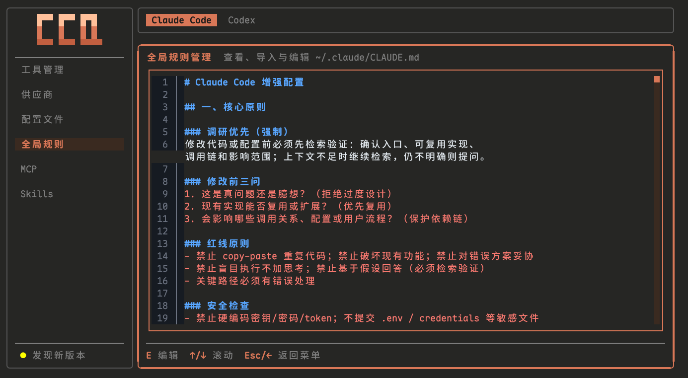

# Claude Code Quickstart (CCQ)

Windows 与 macOS 双平台的 CLI Agent（Claude Code / Codex）开发环境自动化安装器。

> 目标：把「装环境」变成「跑脚本」——Windows 基于 PowerShell 5.1 单运行时，macOS 基于 Homebrew / zsh / nvm，一条命令装好 Node.js / Git 与 `ccq` 管理控制台；Claude Code / Codex 等 CLI Agent 与周边工具统一在 `ccq` 的「工具管理」中按需安装与维护，供应商 / 配置 / MCP / Skills 等也由 `ccq` 管理。

---

## Directory

- [Core Features](#core-features)
- [System Requirements](#system-requirements)
- [Quick Start](#quick-start)
  - [Method 1: Run Directly From The Cloud](#method-1-run-directly-from-the-cloud-recommended)
  - [Method 2: Download And Run A Single File](#method-2-download-and-run-a-single-file)
  - [Method 3: Run From Source](#method-3-run-from-source-developers)
- [Installation Contents](#installation-contents)
- [Manage Console (ccq)](#manage-console-ccq)
- [Project Structure](#project-structure)
- [Frequently Asked Questions](#frequently-asked-questions)
- [License](#license)
- [Related Links](#related-links)

---

## Core Features

- **一键装好开发环境**：一条命令搞定 Windows / macOS 双平台的 Node.js / Git 与 `ccq` 管理控制台，已装组件实时检测自动跳过，无需手动处理版本、编码与初始化顺序
- **Agent 与插件统一管理**：Claude Code / Codex 等 CLI Agent 与 Ccline / CcgWorkflow / OpenSpec / Trellis / CodeGraph 等周边工具，都能在「工具管理」里快捷安装 / 更新 / 卸载
- **终端一键启动控制台**：装好后在任意终端输入 `ccq` 即进入管理控制台，也可用 `ccq cc` / `ccq cx` 等子命令直接启动对应 Agent
- **供应商快捷配置**：内置智谱 GLM / MiniMax / Kimi / DeepSeek 等供应商模板，填个 Key 就能用；Codex 侧支持官方登录（`codex login`）与指定供应商启动
- **配置文件与供应商隔离**：每个供应商独立存放在专属 Profile 文件（Claude Code 存 `~/.claude/providers/`，Codex 存 `~/.codex/<key>.config.toml`），与主配置（`settings.json` / `config.toml`）物理分离；切换或设默认供应商时只按字段所有权合并供应商相关内容（Token / Base URL / 模型键），不触碰语言、权限、hooks、statusLine 等其他配置，MCP 也各自独立存放，切换供应商不会影响其余任何配置
- **配置与规则一键导入**：推荐的 `settings.json` 配置与全局规则（CLAUDE.md）可一键补全导入，只补缺失项、不覆盖你已有的设置
- **MCP 多 Agent 开关**：内置 Context7 / DeepWiki / Playwright / Exa 等 MCP 模板，凭据录入一次持久保存，可按 Claude Code / Codex 分别启用或禁用
- **Skills 快捷管理**：基于官方 `npx skills` 管理共享本体与 Agent 投影；支持 Claude-only 显式收编、Codex-only/独立副本链接修复，以及同名不同源经强确认后的安全替换
- **明暗主题自适应**：TUI 自动跟随终端明暗主题切换，深浅色终端都清晰顺眼
- **应用内自更新**：`ccq` 本体支持应用内检查更新，强确认后原子替换并可一键重启，更新前自动快照备份、失败可回滚

---

## System Requirements

| Project | Windows | macOS |
|---|---|---|
| 操作系统 | Windows 10 1903 (18362)+ / Windows 11 | macOS 12 Monterey 或更新版本 |
| Shell / 运行时 | PowerShell 5.1+ 单运行时直跑（PS7 作为推荐组件非阻塞安装，不 re-exec） | `/bin/zsh`，云端入口兼容 `curl ... | bash` |
| 包管理器 | winget | Homebrew |
| Node.js | 现有 node/npm 版本达标则跳过；否则优先在当前 provider 内安装/更新到 LTS；无法安全修复时才选择 nvm-windows 或 Node.js 直装兜底 | 现有 node/npm 版本达标则跳过；否则优先通过当前 fnm/nvm 安装/切换 LTS；无法原地修复时通过 nvm 官方脚本兜底 |
| 权限 | 管理员权限（建议） | 普通用户即可；Homebrew 安装可能需要用户确认 |
| 网络 | 可访问 GitHub、npm registry | 可访问 GitHub、npm registry、Homebrew 源 |

---

## Quick Start

### Method 1: Run Directly From The Cloud (Recommended)

#### Windows

##### 1) Installer Script (PS 5.1+)

请先以**管理员身份**打开 Windows PowerShell 5.1 或 PowerShell 7，再执行安装命令：

```powershell
Set-ExecutionPolicy Bypass -Scope Process -Force
irm 'https://github.com/MrNine-666/claude-code-quickstart/releases/latest/download/install.ps1' | iex
```

PS 5.1 单运行时直跑：前置检测内联（Windows 版本 / winget 自动安装 / PS7 非阻塞推荐）+ bootstrap Basic 两步直装（NodeJS / Git），**末尾确认下载 ccq.exe 到 `%USERPROFILE%\.local\bin\` 并加入用户 PATH**。Claude Code / Codex 请在安装完成后运行 `ccq`，进入「工具管理」按需安装。

安装完成后，建议在 Windows Terminal 中将 PowerShell 7 配置为管理员方式打开；后续新开终端执行 `ccq` 进入管理控制台。


##### 2) Management Console

安装完成后，**开新终端**直接运行：

```powershell
ccq
```

进入 6 菜单管理控制台（工具管理 / 供应商 / 配置文件 / 全局规则 / MCP / Skills）。

#### macOS

首次安装入口（macOS 12+）：

```sh
curl -fsSL "https://github.com/MrNine-666/claude-code-quickstart/releases/latest/download/install.sh" | bash
```


安装完成后，**开新终端**直接运行：

```sh
ccq
```

进入 6 菜单管理控制台。

---

### Method 2: Download And Run A Single File

从 [Releases](../../releases) 下载：

- Windows: `install.ps1` + `ccq-windows-{x64|arm64}.exe`（2 件）
- macOS: `install.sh` + `ccq-macos-{x64|arm64}`（2 件）

Windows 执行示例：

```powershell
# 安装（PS 5.1+，末尾确认下载 ccq.exe）
Set-ExecutionPolicy -ExecutionPolicy RemoteSigned -Scope CurrentUser -Force
.\install.ps1

# 管理（安装后开新终端）
ccq
```

macOS 执行示例：

```sh
# 安装（末尾确认下载 ccq）
bash ./install.sh

# 管理（安装后开新终端）
ccq
```

---

### Method 3: Run From Source (Developers)

Windows：

```powershell
git clone https://github.com/MrNine-666/claude-code-quickstart.git
cd claude-code-quickstart

# 安装（PS 5.1+）
Set-ExecutionPolicy -ExecutionPolicy RemoteSigned -Scope CurrentUser -Force
pwsh -File installer/windows/Install.ps1

# 管理（从源码运行 TUI）
cd tui
bun run dev
```

macOS：

```sh
git clone https://github.com/MrNine-666/claude-code-quickstart.git
cd claude-code-quickstart

# 安装
zsh installer/macos/Install.zsh

# 管理（从源码运行 TUI）
cd tui
bun run dev
```

模拟 `irm | iex`（可传参，如 `-OutputMode Developer` 全量输出）：

```powershell
pwsh -File installer/build.ps1
& ([scriptblock]::Create((Get-Content "dist/install.ps1" -Raw))) -OutputMode Developer
```

模拟 macOS 构建产物入口：

```sh
sh installer/build.sh
bash dist/install.sh --list-steps
```

---

## Installation Contents

### Windows

Windows 入口基于 PowerShell 5.1+ 单运行时执行，安装基础环境并准备 `ccq.exe`：

1. Node.js LTS
2. Git
3. `ccq.exe` 管理控制台（下载到 `%USERPROFILE%\.local\bin\` 并加入用户 PATH）

Claude Code / Codex 不再由 installer 直接安装；安装完成后运行 `ccq`，在 `Claude Code` / `Codex` Header 下进入「工具管理」安装或维护对应工具。

### macOS

macOS 入口从 `curl ... | bash` 启动并切换到 `/bin/zsh`，通过 Homebrew + Node.js 检测（nvm 官方安装兜底）准备基础环境与 `ccq`：

1. Homebrew
2. Node.js LTS（现有 node/npm 版本达标则跳过；否则优先通过当前 fnm/nvm 安装/切换 LTS，无法原地修复时通过 nvm 官方脚本兜底）
3. Git
4. `ccq` 管理控制台（下载到 `~/.local/bin/` 并确保该目录在 PATH）

安装完成后，Claude Code / Codex、供应商、配置、全局规则、MCP、Skills、工具等均在 `ccq` 管理控制台操作，详见下节。

---

## Manage Console (ccq)

安装后直接运行 `ccq` 命令进入管理控制台。`ccq` 是 OpenTUI + Bun 构建的单文件可执行产物（`tui/` 子项目交叉编译而来），安装时下载到 `~/.local/bin/ccq[.exe]`（与 Claude Code native installer 同目录），通过用户级 PATH 天然可达。控制台提供 **6 菜单**，右侧 content 顶部用全称 Header 在 `Claude Code` / `Codex` 间切换当前 Agent 上下文；也可以直接使用非交互 CLI 子命令完成常用操作：

### CLI Subcommands

| Command | Description |
|---|---|
| `ccq` | 进入 OpenTUI 6 菜单管理控制台 |
| `ccq cc <provider> [claude-args...]` | 临时使用指定 provider 启动 Claude Code；不写盘，后续参数透传给 `claude` |
| `ccq cx [profile] [codex-args...]` | 启动 Codex；指定 profile 时使用 `codex --profile <profile>`，不注入 ccq vault/env |
| `ccq ls [--tool claude\|codex]` | 列出 Claude provider 或 Codex profile；默认 `--tool claude` |
| `ccq use <provider> [--tool claude\|codex]` | 设置 Claude 默认 provider 或 Codex 默认 profile；Codex 结构化写 `CODEX_HOME/config.toml` |
| `ccq update [--check]` | 检查或更新 ccq 可执行文件；`--check` 只检查不下载 |
| `ccq tools update [name]` | 更新全部可更新工具，或只更新指定工具 |
| `ccq tools uninstall <name> [--yes\|-y]` | 卸载指定工具；默认要求 y/N 确认，传 `--yes` 或 `-y` 跳过确认 |
| `ccq uninstall [--yes\|-y]` | 卸载 ccq 本体；默认要求 y/N 确认，传 `--yes` 或 `-y` 跳过确认 |

卸载类命令在非 TTY 环境必须传 `--yes` 或 `-y`，否则会拒绝执行以避免误删；`ccq cc` / `ccq cx` 是启动类动词（继承 TTY、参数透传给底层工具），`ccq use` 是管理类动词（修改持久默认配置）。

### 1) Tool Management (Tools)

- Agent 组常显 ClaudeCode / CodexCli / AntigravityCli；Ccline 仅 Claude Code；OpenSpec / Trellis / CcgWorkflow / CodeGraph 在两种上下文可见
- 安装 / 更新 / 卸载（强确认 + snapshot 保护）；CodeGraph 安装/更新后校验当前 Agent MCP 接入，更新后重接入已安装的 cc/cx，卸载最后一个 CodeGraph MCP 后自动移除共享 CLI；CcgWorkflow Codex Mode 使用官方非交互 install/uninstall
- 侧边栏底部「检查更新」按钮可更新 ccq 可执行文件本体：发现新版本后弹窗确认，更新中在弹窗内显示 loading（Enter 禁用，Esc 停止更新），完成后可选择立即重启或稍后重启


### 2) Provider Management (Provider)

- Claude Code Header 下：供应商 Profile 的新增 / 编辑 / 删除 / 切换 / 设置默认；配置写入 `~/.claude/settings.json` 的 `env`，Profile 保存到 `~/.claude/providers/`
- Codex Header 下：管理 `$CODEX_HOME/<key>.config.toml`（默认 `~/.codex/<key>.config.toml`）官方 profile 文件；key 同时作为文件名、`--profile` 名、provider id 与默认显示名
- Codex API key 直写 `[model_providers.<key>].experimental_bearer_token`，不进入 ccq vault、不由 `ccq cx` 注入 env；`official login` 类型通过 `codex login` 完成认证
- 内置供应商：智谱 GLM（默认 glm-5.2）、MiniMax（默认 MiniMax-M3）、Kimi Coding Plan（预填 `CLAUDE_CODE_AUTO_COMPACT_WINDOW`）、DeepSeek（默认 deepseek-v4-pro[1m]，预填 subagent/effort env）、自定义供应商


### 3) Configuration Files (Config)

- Claude Code Header 下查看 `~/.claude/settings.json` 推荐配置；Codex Header 下查看 `CODEX_HOME/config.toml` 推荐配置
- 复用预览 / 编辑 / `Ctrl+T` 推荐 / `Ctrl+O` fill-missing 导入；不管理 provider、MCP、Skills 或规则文件内容


### 4) Global Rules (Prompts)

- Claude Code Header 下维护 `~/.claude/CLAUDE.md`；Codex Header 下维护 `CODEX_HOME/AGENTS.md`
- 复用预览 / 编辑 / `Ctrl+T` 推荐 / `Ctrl+O` 导入，Codex 推荐内容复用 Claude Code 推荐规则



### 5) MCP

- 列表仅展示已安装 Server，行显示状态圆点 + Server ID
- `A` 新增、`E` 编辑（JSON 即真源，内置模板一键带出配置与凭据提示）、`D` 删除
- `Enter` 切换当前 Header 对应 Agent 的启用 / 禁用状态；Claude Code 写 `~/.claude.json`，Codex 结构化写 `CODEX_HOME/config.toml`
- 凭据与配置备份持久化到 `~/.ccq/mcp-meta.json`，但 Active/Disabled 状态以运行时配置文件为事实源
- 内置 MCP：Context7 / DeepWiki / Tavily / Playwright / Exa Search / ACE Tool / MasterGo / Figma / Chrome DevTools
- 支持 none / single-key / args-token / url-embedded 等凭据类型，新增或编辑时按模板提示填写


### 6) Skills

- 列表页：一次全量检测同时展示 Claude Code / Codex 状态；`Enter` 管理安装，Claude-only 可在强确认后安装到 Codex 并迁移为共享本体，Codex-only 或 Windows 独立副本可重试 Claude 共享链接；检测与刷新不会自动改动已有 Skill
- 安装页（`a` 进入）：远程搜索框 + 扁平多选列表；双侧都没有的 Skill 正常安装，同来源已安装或来源未知项禁选；可证明同名不同源的项显示“已有同名”，执行前逐项确认旧/新来源和覆盖影响
- 物理存储、canonical 与 Agent 链接仍由官方 Skills CLI 负责；ccq 仅在目标目录外创建安全恢复快照，并在 `add` 与文件系统/lock 对账成功后清理未选择的旧投影


---

## Project Structure

```text
claude-code-quickstart/
├── dist/                              # 默认构建输出：install.ps1/install.sh + 4 平台 ccq 可执行文件
├── tui/                               # 根级 OpenTUI TUI 子项目（src/ → bun build --compile）
│   ├── contracts/                     # TUI 链契约：claude-config / mcp-servers / providers / templates（内嵌进可执行文件）
│   ├── scripts/                       # 构建 / smoke / parity 验证脚本
│   └── src/                           # 6 菜单管理控制台实现
├── installer/
│   ├── build.ps1                      # Windows / GitHub Actions 构建入口（install.ps1 + Windows ccq）
│   ├── build.sh                       # macOS / Unix 构建入口（install.sh + macOS ccq）
│   ├── contracts/                     # install 链契约：steps / build / cleanup-policy
│   ├── windows/
│   │   ├── Install.ps1                # Windows PS 5.1+ 安装入口（前置检测内联 + Basic 直装 + 末尾下载 ccq.exe）
│   │   ├── core/                      # Windows PowerShell runtime core（含 ccq 可执行文件管理函数）
│   │   └── steps/                     # Windows Basic 步骤实现
│   └── macos/
│       ├── Install.zsh                # macOS 安装入口（前置检测内联 + Basic 直装 + 末尾下载 ccq）
│       ├── core/                      # macOS zsh runtime core（含 ccq 可执行文件管理函数）
│       └── steps/                     # macOS Basic 步骤实现
```

---

## Frequently Asked Questions

### Q1: What If Installation Fails?

直接重新运行安装脚本即可。CCQ 会实时检测并跳过已安装项。

### Q2: What If `ccq` Cannot Be Found?

按你的场景处理：

1. **Windows 刚刚执行完 install**
   - `ccq.exe` 已下载到 `%USERPROFILE%\.local\bin\` 并加入用户 PATH，**先新开一个终端**再试：

   ```powershell
   ccq
   ```

   - 如果当前终端也想立即可用，可临时把目录加进当前会话 PATH：

   ```powershell
   $env:Path = "$env:USERPROFILE\.local\bin;$env:Path"
   ccq
   ```

2. **macOS 用户**
   - `ccq` 已下载到 `~/.local/bin/` 并确保该目录在 PATH，**新开 zsh 终端**，或在当前会话临时追加：

   ```sh
   export PATH="$HOME/.local/bin:$PATH"
   ccq
   ```

---

## License

[MIT](LICENSE)

---

## Related Links

- [LINUX DO](https://linux.do/)

