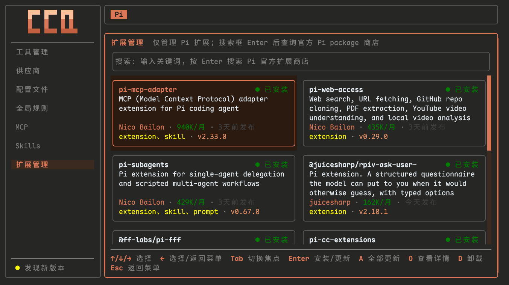

# Claude Code Quickstart (CCQ)

Windows 与 macOS 双平台的 CLI Agent 环境安装器与管理控制台，支持 Claude Code / Codex / Pi。

> 把「装环境」变成「跑脚本」：一条命令装好 Node.js / Git 与 `ccq` 控制台（Windows 基于 PowerShell 5.1 单运行时，macOS 基于 Homebrew / zsh / nvm），然后在一个终端界面里统一管理 Claude Code / Codex / Pi 三个 Agent 的工具、供应商、配置、MCP、Skills 与扩展。

---

## Directory

- [Problems It Solves](#problems-it-solves)
- [Core Features](#core-features)
- [System Requirements](#system-requirements)
- [Quick Start](#quick-start)
  - [Method 1: Run Directly From The Cloud](#method-1-run-directly-from-the-cloud-recommended)
  - [Method 2: Download And Run A Single File](#method-2-download-and-run-a-single-file)
  - [Method 3: Run From Source](#method-3-run-from-source-developers)
- [Installation Contents](#installation-contents)
- [Manage Console (ccq)](#manage-console-ccq)
- [Project Structure](#project-structure)
- [Frequently Asked Questions](#frequently-asked-questions)
- [License](#license)
- [Related Links](#related-links)

---

## Problems It Solves

| 你会遇到的麻烦 | CCQ 的处理方式 |
|---|---|
| 装环境要自己排坑：Node.js 版本、Git、编码、安装顺序、PATH 各管一段 | 一条命令装完（Windows 走 PowerShell 5.1 单运行时，macOS 走 Homebrew / zsh / nvm），已装组件自动跳过，重复执行也安全 |
| Claude Code / Codex / Pi 各有一套配置目录与格式，换个 Agent 就要重新查文档 | 一个 `ccq` 管三个 Agent，顶部 Header 切换当前上下文，三套配置互不影响 |
| 手改 `settings.json` / `config.toml` 换供应商，容易连带改坏语言、权限、hooks | 供应商独立 Profile 存放，切换或设默认只更新供应商相关字段，其余配置原样不动 |
| 给 Pi 加自定义 Provider 时，模型能力（上下文窗口、输出上限、价格、思考等级）要逐项手填 | 从上游发现模型，并按 Pi 官方目录自动补齐能力字段 |
| MCP 凭据在多处重复录入，Skills 装在哪、扩展有没有更新全靠记忆 | 凭据录入一次持久保存；MCP / Skills / 扩展各有独立视图展示状态并一键维护 |
| 卸载或覆盖操作怕残留、怕误删 | 关键操作带确认与快照保护，卸载不触碰用户数据与已有配置 |

---

## Core Features

- **一条命令装好环境，重复执行也安全**：Windows 走 PowerShell 5.1 单运行时，macOS 走 Homebrew / zsh / nvm，自动装好 Node.js / Git 与 `ccq` 控制台；已装组件实时检测跳过，不用处理版本、编码与安装顺序
- **三个 Agent，一个控制台**：Claude Code / Codex / Pi 的工具、供应商、配置、MCP、Skills 都在 `ccq` 里管理，顶部 Header 切换 Agent 上下文，三套配置互不干扰
- **供应商开箱即用**：内置智谱 GLM / DeepSeek / Kimi Coding Plan / MiniMax 等模板，填 Key 就能跑；支持官方登录（`codex login`）、模型发现与 OAuth 状态展示
- **Pi 模型能力自动补齐**：从上游发现模型后，按 Pi 官方目录补上上下文窗口、输出上限、输入类型、价格与思考等级等能力字段，省去逐项查文档
- **配置隔离，切换零副作用**：每个供应商独立存放在专属 Profile 文件，切换或设默认只更新供应商相关字段（Token / Base URL / 模型键），语言、权限、hooks、statusLine 等个人配置原样保留
- **推荐配置一键导入**：内置推荐配置可一键补全，只补缺失项、不覆盖你已有的设置
- **MCP 一次录入，多端复用**：Context7 / DeepWiki / Playwright / Exa 等模板，凭据录入一次持久保存，可按 Claude Code / Codex / Pi 分别启停
- **Skills 与扩展统一维护**：Skills 基于官方 `npx skills` 管理共享本体与 Agent 投影，支持来源识别、批量更新与安全卸载；Pi 扩展可搜索官方 package 目录并一键安装 / 更新 / 卸载
- **顺手的使用体验**：TUI 自动跟随终端明暗主题；`ccq` 本体支持应用内检查更新，更新前自动快照、失败可回滚

---

## System Requirements

| Project | Windows | macOS |
|---|---|---|
| 操作系统 | Windows 10 1903 (18362)+ / Windows 11 | macOS 12 Monterey 或更新版本 |
| Shell / 运行时 | PowerShell 5.1+（PS 7 作为推荐组件自动安装） | `/bin/zsh`，云端入口兼容 `curl ... | bash` |
| 包管理器 | winget | Homebrew |
| Node.js | 已有达标版本则直接复用，否则自动安装 / 升级到 LTS（必要时用 nvm-windows 兜底） | 已有达标版本则直接复用，否则自动安装 / 切换到 LTS（必要时用 nvm 官方脚本兜底） |
| 权限 | 管理员权限（建议） | 普通用户即可；Homebrew 安装可能需要用户确认 |
| 网络 | 可访问 GitHub、npm registry | 可访问 GitHub、npm registry、Homebrew 源 |

---

## Quick Start

### Method 1: Run Directly From The Cloud (Recommended)

#### Windows

##### 1) Installer Script (PS 5.1+)

请先以**管理员身份**打开 Windows PowerShell 5.1 或 PowerShell 7，再执行安装命令：

```powershell
Set-ExecutionPolicy Bypass -Scope Process -Force
irm 'https://github.com/MrNine-666/claude-code-quickstart/releases/latest/download/install.ps1' | iex
```

脚本会自动检查 Windows 版本、准备 winget 与 PowerShell 7，并装好 Node.js 与 Git；**最后确认下载 `ccq.exe` 到 `%USERPROFILE%\.local\bin\` 并加入用户 PATH**。Claude Code / Codex / Pi 请在安装完成后运行 `ccq`，从「工具管理」按需安装。

安装完成后，建议在 Windows Terminal 中将 PowerShell 7 配置为管理员方式打开；后续新开终端执行 `ccq` 进入管理控制台。


##### 2) Management Console

安装完成后，**开新终端**直接运行：

```powershell
ccq
```

即可进入 `ccq` 管理控制台（工具管理 / 供应商 / 配置文件 / 全局规则 / MCP / Skills / 扩展管理）。

#### macOS

首次安装入口（macOS 12+）：

```sh
curl -fsSL "https://github.com/MrNine-666/claude-code-quickstart/releases/latest/download/install.sh" | bash
```


安装完成后，**开新终端**直接运行：

```sh
ccq
```

即可进入 `ccq` 管理控制台。

#### 只安装 CCQ 管理控制台（不安装 Node.js / Git）

如果只需要 `ccq` 管理控制台，不需要安装器准备 Node.js / Git 等基础环境：

Windows（Windows PowerShell 5.1+）：

```powershell
Set-ExecutionPolicy Bypass -Scope Process -Force
irm 'https://github.com/MrNine-666/claude-code-quickstart/releases/latest/download/download-ccq.ps1' | iex
```

macOS（zsh）：

```sh
curl -fsSL "https://github.com/MrNine-666/claude-code-quickstart/releases/latest/download/download-ccq.zsh" | zsh
```

两个入口只把对应平台的 `ccq` 可执行文件安装到用户目录的 `.local/bin` 并加入用户 PATH，不会安装或更新 Node.js、Git、Claude Code、Codex、Pi。

---

### Method 2: Download And Run A Single File

从 [Releases](../../releases) 下载：

- Windows: `install.ps1` / `download-ccq.ps1` + `ccq-windows-{x64|arm64}.exe`
- macOS: `install.sh` / `download-ccq.zsh` + `ccq-macos-{x64|arm64}`

完整 Release 产物为 12 个文件：`install.ps1`、`download-ccq.ps1`、`install.sh`、`download-ccq.zsh`，以及四个平台 ccq 可执行文件及其自更新用 `.gz` 传输资产（`ccq-windows-x64.exe`、`ccq-windows-x64.exe.gz`、`ccq-windows-arm64.exe`、`ccq-windows-arm64.exe.gz`、`ccq-macos-x64`、`ccq-macos-x64.gz`、`ccq-macos-arm64`、`ccq-macos-arm64.gz`）。

Windows 执行示例：

```powershell
# 安装（PS 5.1+，末尾确认下载 ccq.exe）
Set-ExecutionPolicy -ExecutionPolicy RemoteSigned -Scope CurrentUser -Force
.\install.ps1

# 管理（安装后开新终端）
ccq
```

macOS 执行示例：

```sh
# 安装（末尾确认下载 ccq）
bash ./install.sh

# 管理（安装后开新终端）
ccq
```

---

### Method 3: Run From Source (Developers)

Windows：

```powershell
git clone https://github.com/MrNine-666/claude-code-quickstart.git
cd claude-code-quickstart

# 安装（PS 5.1+）
Set-ExecutionPolicy -ExecutionPolicy RemoteSigned -Scope CurrentUser -Force
pwsh -File installer/windows/Install.ps1

# 管理（从源码运行 TUI）
cd tui
bun run dev
```

macOS：

```sh
git clone https://github.com/MrNine-666/claude-code-quickstart.git
cd claude-code-quickstart

# 安装
zsh installer/macos/Install.zsh

# 管理（从源码运行 TUI）
cd tui
bun run dev
```

模拟 `irm | iex`（可传参，如 `-OutputMode Developer` 全量输出）：

```powershell
pwsh -File installer/build.ps1
& ([scriptblock]::Create((Get-Content "dist/install.ps1" -Raw))) -OutputMode Developer
```

模拟 macOS 构建产物入口：

```sh
sh installer/build.sh
bash dist/install.sh --list-steps
```

---

## Installation Contents

### Windows

Windows 入口基于 PowerShell 5.1+ 单运行时执行，安装基础环境并准备 `ccq.exe`：

1. Node.js LTS
2. Git
3. `ccq.exe` 管理控制台（下载到 `%USERPROFILE%\.local\bin\` 并加入用户 PATH）

安装脚本只负责把基础环境与 `ccq` 准备好；Claude Code / Codex / Pi 及周边工具在装好后运行 `ccq`，从「工具管理」按需安装与维护。

### macOS

macOS 入口从 `curl ... | bash` 启动并切换到 `/bin/zsh`，通过 Homebrew + Node.js 检测（nvm 官方安装兜底）准备基础环境与 `ccq`：

1. Homebrew
2. Node.js LTS（现有 node/npm 版本达标则跳过；否则优先通过当前 fnm/nvm 安装/切换 LTS，无法原地修复时通过 nvm 官方脚本兜底）
3. Git
4. `ccq` 管理控制台（下载到 `~/.local/bin/` 并确保该目录在 PATH）

安装完成后，Claude Code / Codex / Pi、供应商、配置、全局规则、MCP、Skills、工具与 Pi 扩展等均在 `ccq` 管理控制台操作，详见下节。

---

## Manage Console (ccq)

安装后在任意终端运行 `ccq` 即可进入管理控制台。`ccq` 是基于 OpenTUI + Bun 的单文件可执行程序（由 `tui/` 子项目交叉编译），安装到 `~/.local/bin/ccq[.exe]` 并加入用户级 PATH，开箱即用。

控制台提供 **7 个功能菜单**：工具管理 / 供应商 / 配置文件 / 全局规则 / MCP / Skills / 扩展管理；顶部 Header 在 `Claude Code` / `Codex` / `Pi` 间切换当前 Agent 上下文，扩展管理固定使用 Pi。常用操作也提供非交互 CLI 子命令，方便脚本化调用：

### CLI Subcommands

| Command | Description |
|---|---|
| `ccq` | 进入 OpenTUI 7 菜单管理控制台 |
| `ccq ls [--tool claude\|codex\|pi]` | 列出 Claude provider、Codex profile 或 Pi provider；默认 `--tool claude` |
| `ccq use <provider> [--tool claude\|codex]` | 将 Claude provider 或 Codex profile 设为默认（Pi 的默认 Provider 在「配置文件」页设置） |
| `ccq update [--check]` | 检查或更新 ccq 可执行文件；`--check` 只检查不下载 |
| `ccq tools update [name]` | 更新全部可更新工具，或只更新指定工具 |
| `ccq tools uninstall <name> [--yes\|-y]` | 卸载指定工具；默认要求 y/N 确认，传 `--yes` 或 `-y` 跳过确认 |
| `ccq uninstall [--yes\|-y]` | 卸载 ccq 本体；默认要求 y/N 确认，传 `--yes` 或 `-y` 跳过确认 |

卸载类命令默认需要 y/N 二次确认，避免误删；非交互环境（脚本、管道）需显式传 `--yes` 或 `-y`。`ccq use` 会写入持久默认配置。

### 指定供应商启动 Agent

`ccq` 只负责管理配置，不接管 Agent 进程。需要在当前终端临时指定供应商时，直接调用底层 CLI 即可：

```powershell
# 临时指定 Claude Code 供应商
claude --settings ~/.claude/providers/custom.json

# 临时指定 Codex 供应商
codex --profile custom

# 临时指定 Pi provider 与模型
pi --provider custom --model model-id
```

Agent 参数可以直接追加：

```powershell
claude --settings ~/.claude/providers/custom.json -p "你好"
codex --profile custom -m gpt-5
```

如需持久设为默认供应商，Claude Code 与 Codex 可执行：

```powershell
ccq use custom --tool claude
ccq use custom --tool codex
```

Pi 的默认 Provider 在 `ccq` 的「配置文件」页设置 `settings.json.defaultProvider`。设置好之后直接运行 `claude` / `codex` / `pi` 即可，`ccq` 不参与 Agent 进程生命周期。

### 1) Tool Management (Tools)

- Agent 组常显 ClaudeCode / CodexCli / PiCli；Ccline 与 Pi Web 属于「全局伴随工具」；OpenSpec / Trellis / CcgWorkflow / CodeGraph 等共享工具按支持的上下文出现
- 每个工具都能一键安装 / 更新 / 卸载，关键操作带强确认与快照保护；CodeGraph 会跟随 MCP 接入状态联动，CcgWorkflow 的 Codex Mode 走官方非交互安装
- 侧边栏底部「检查更新」可直接升级 `ccq` 本体：弹窗确认后原地替换，更新中可 Esc 停止，完成后可选择立即重启或稍后重启


### 2) Provider Management (Provider)

- Claude Code Header 下：供应商 Profile 的新增 / 编辑 / 删除 / 切换 / 设置默认；配置写入 `~/.claude/settings.json` 的 `env`，Profile 保存到 `~/.claude/providers/`
- Codex Header 下：管理 `$CODEX_HOME/<key>.config.toml` 官方 profile 文件（默认在 `~/.codex/`），key 即 `codex --profile` 使用的名字
- Codex API key 写入 profile 的 provider 字段，官方账号通过 `codex login` 登录，ccq 展示登录状态
- Codex 一键模板：智谱 GLM、DeepSeek、MiniMax 开箱可用，模型字段留空待你填写或由模型发现带出
- Pi Header 下：按 provider 级别管理 `~/.pi/agent/auth.json`、`models.json` 与 `settings.json`，支持 API Key 自定义 Provider、OAuth 状态展示与模型维护；登录 / 注销由 Pi 原生 `/login` / `/logout` 负责
- **模型发现**：填好 Base URL 与 API Key 后按 `Ctrl+D` 拉取上游模型列表，支持 `anthropic-messages` / `openai-completions` / `openai-responses` / `google-generative-ai` 四类协议；无法列出模型的端点会提示手工填写模型 ID
- **能力自动补全**：在模型列表按 `Space` 即可按 Pi 官方目录（`https://pi.dev/api/models`）匹配来源，自动补齐上下文窗口、输出上限、输入类型、价格与思考等级；同名多来源时先看摘要或最终 JSON，按 `Enter` 确认来源，`Space` 勾选 / 取消勾选（取消后再次按 `Space` 可换来源）、`Ctrl+S` 保存
- **补全不覆盖你的配置**：上游与官方目录只用于填充能力字段，你手工配置的值与 Pi 支持的扩展字段都会保留，协议（API）以表单选择为准；目录不可达时按已有信息保存并提示
- 凭据与模型定义分开存放：API Key 写入 `auth.json`，模型能力写入 `models.json`；通过 Pi `/login` 建立的账号在列表中只读展示
- 供应商卡片一眼看懂：API Key 类展示 `baseUrl · 掩码凭据 · 自定义/官方`，OAuth 类展示授权登录状态
- 内置供应商：智谱 GLM、DeepSeek、Kimi Coding Plan 1M / 256K、MiniMax、自定义供应商；模型字段可手动填写，也可用模型发现自动带出
  - 两个 Kimi 模板同一端点、同一 Key，只差上下文档位：1M 版需 Allegretto 及以上套餐，256K 版 Moderato 及以上即可且 token 消耗约为 1M 版一半；Andante 档可在表单里把模型改为 `kimi-for-coding`


### 3) Configuration Files (Config)

- 一个页面看三种 Agent 的推荐配置：Claude Code 是 `~/.claude/settings.json`，Codex 是 `CODEX_HOME/config.toml`，Pi 是 `~/.pi/agent/settings.json`
- Pi 配置页可维护通用运行配置（`defaultProvider`、主题、默认工具集、TUI 模式等），推荐配置带字段注释，每个字段的作用一眼可见
- 三个 Header 都支持预览 / 编辑 / `Ctrl+T` 推荐配置 / `Ctrl+O` 补全导入；供应商凭据、模型定义、MCP、Skills 等由各自模块维护，编辑配置文件不会覆盖它们


### 4) Global Rules (Prompts)

- Claude Code Header 下维护 `~/.claude/CLAUDE.md`；Codex Header 下维护 `CODEX_HOME/AGENTS.md`；Pi Header 下维护 `~/.pi/agent/AGENTS.md`
- 按 Agent 上下文切换预览、编辑与保存全局规则文件


### 5) MCP

- 列表展示已安装 Server 与当前 Agent 的启用状态（状态圆点 + Server ID）
- `A` 新增、`E` 编辑、`D` 删除；编辑时 JSON 即真源，内置模板一键带出配置与凭据提示
- `Enter` 切换当前 Header 对应 Agent 的启用 / 禁用
- 凭据录入一次即持久保存，可按 Claude Code / Codex / Pi 分别启停：Claude Code 写 `~/.claude.json`，Codex 写入 `CODEX_HOME/config.toml`，Pi 通过 `pi-mcp-adapter` 生效
- 内置 MCP：Context7 / DeepWiki / Tavily / Playwright / Exa Search / ACE Tool / MasterGo / Figma / Chrome DevTools
- 支持 none / single-key / args-token / url-embedded 等凭据类型，新增或编辑时按模板提示填写


### 6) Skills

- 列表页一次全量检测，同时展示 Skill 在 Claude Code / Codex / Pi 三侧的安装状态
- 安装页（`a` 进入）内置远程搜索与多选安装，已安装项自动识别来源；同名不同源会以「已有同名」提示并逐项确认，避免误覆盖
- 物理存储与 Agent 链接交由官方 Skills CLI 维护，ccq 额外在目标目录外保留安全快照；检测与刷新不会改动你已有的 Skill
- Pi 侧通过官方 Skills CLI 安装到 `~/.pi/agent/skills`，与 Claude Code / Codex 各自独立


### 7) Extensions (Pi Packages)

- 扩展管理固定使用 Pi Header：空的搜索框列出已安装扩展，输入关键词按 `Enter` 搜索官方 package 目录
- 列表展示 package 的资源类型、作者、版本、下载量与安装状态，`O` 可打开仓库详情
- `Enter` 安装 / 更新当前扩展，`A` 更新全部已安装扩展，`D` 卸载
- 扩展为全局安装；卸载只移除 package，`~/.pi/agent` 下的设置、凭据、会话与 Skills 不受影响



---

## Project Structure

```text
claude-code-quickstart/
├── dist/                              # 默认构建输出：install/download-ccq 脚本 + 4 平台 ccq 可执行文件与 .gz
├── tui/                               # 根级 OpenTUI TUI 子项目（src/ → bun build --compile）
│   ├── contracts/                     # TUI 链契约：claude-config / pi-config / pi-providers / mcp-servers / providers（内嵌进可执行文件）
│   ├── scripts/                       # 构建 / smoke / parity 验证脚本
│   └── src/                           # 7 菜单管理控制台实现
├── installer/
│   ├── build.ps1                      # Windows / GitHub Actions 构建入口（install.ps1 / download-ccq.ps1 + Windows ccq）
│   ├── build.sh                       # macOS / Unix 构建入口（install.sh / download-ccq.zsh + macOS ccq）
│   ├── contracts/                     # install 链契约：steps / build / cleanup-policy
│   ├── windows/
│   │   ├── Install.ps1                # Windows PS 5.1+ 完整安装入口（前置检测内联 + Basic 直装 + 末尾下载 ccq.exe）
│   │   ├── Download-Ccq.ps1           # Windows 专用 CCQ 下载入口（只装 ccq，不装基础环境）
│   │   ├── core/                      # Windows PowerShell runtime core（Ccq.ps1 为 CCQ 行为唯一实现）
│   │   └── steps/                     # Windows Basic 步骤实现
│   └── macos/
│       ├── Install.zsh                # macOS 完整安装入口（前置检测内联 + Basic 直装 + 末尾下载 ccq）
│       ├── Download-Ccq.zsh           # macOS 专用 CCQ 下载入口（只装 ccq，不装基础环境）
│       ├── core/                      # macOS zsh runtime core（Ccq.zsh 为 CCQ 实现，Load.zsh 为加载顺序唯一声明）
│       └── steps/                     # macOS Basic 步骤实现
```

---

## Frequently Asked Questions

### Q1: What If Installation Fails?

直接重新运行安装脚本即可。CCQ 会实时检测并跳过已安装项，重复执行是安全的。

### Q2: What If `ccq` Cannot Be Found?

按你的场景处理：

1. **Windows 刚刚执行完 install**
   - `ccq.exe` 已下载到 `%USERPROFILE%\.local\bin\` 并加入用户 PATH，**先新开一个终端**再试：

   ```powershell
   ccq
   ```

   - 如果当前终端也想立即可用，可临时把目录加进当前会话 PATH：

   ```powershell
   $env:Path = "$env:USERPROFILE\.local\bin;$env:Path"
   ccq
   ```

2. **macOS 用户**
   - `ccq` 已下载到 `~/.local/bin/` 并确保该目录在 PATH，**新开 zsh 终端**，或在当前会话临时追加：

   ```sh
   export PATH="$HOME/.local/bin:$PATH"
   ccq
   ```

---

## License

[MIT](LICENSE)

---

## Related Links

- [LINUX DO](https://linux.do/)
