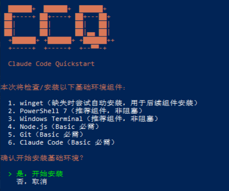
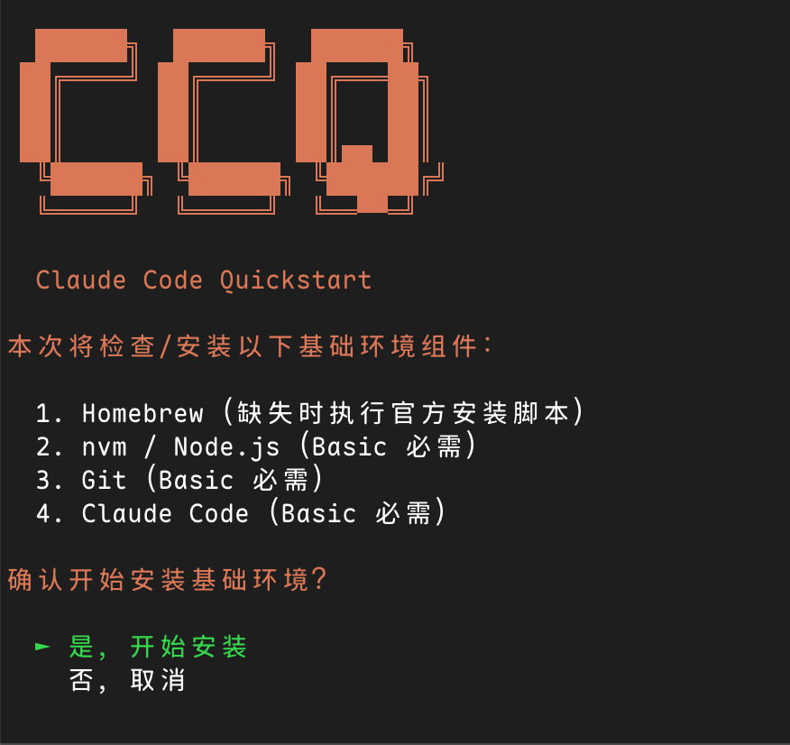
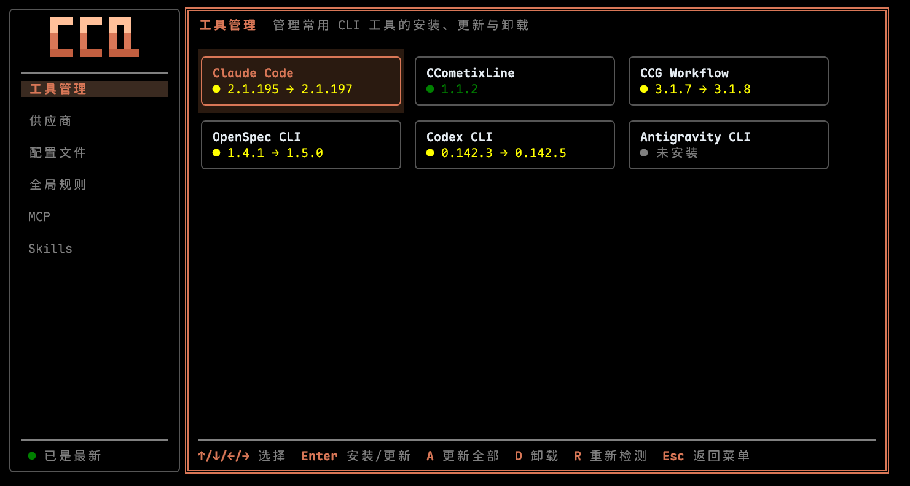
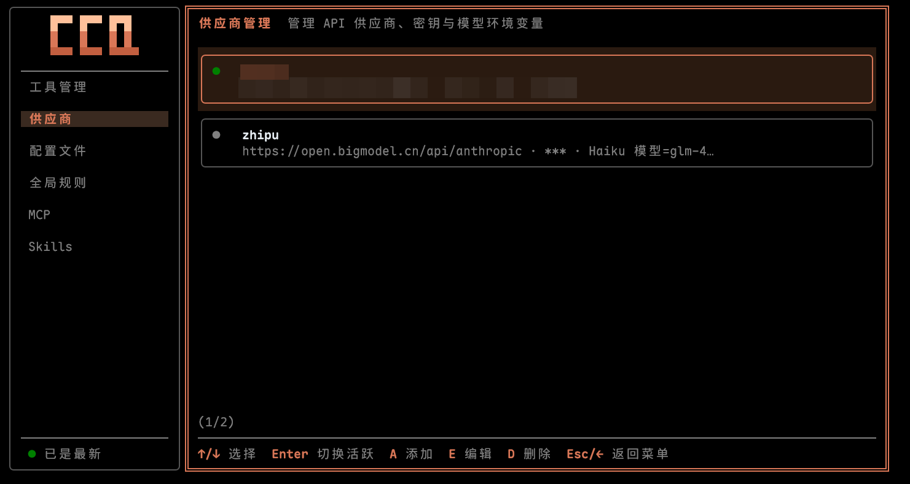
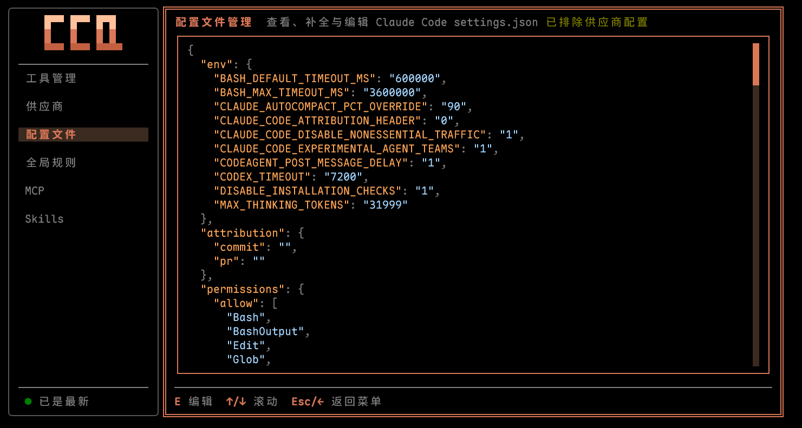
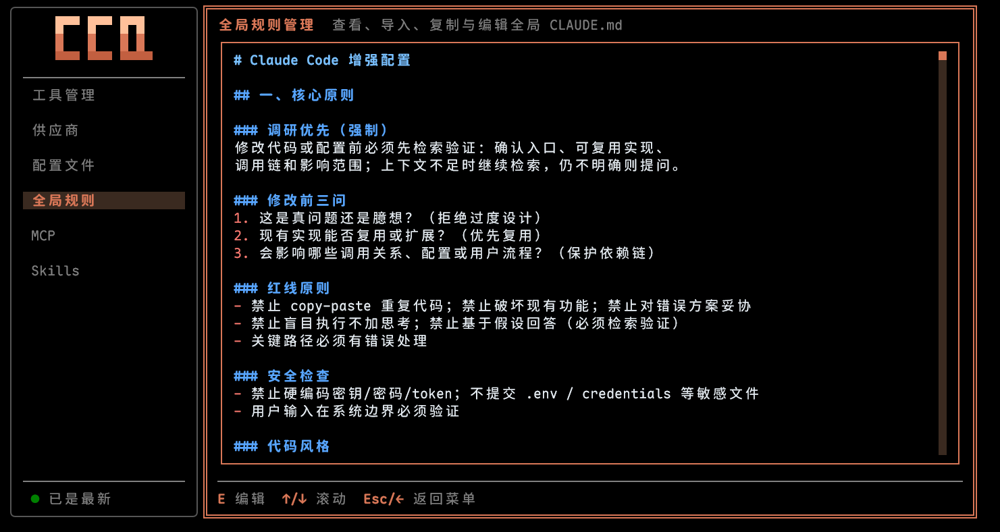
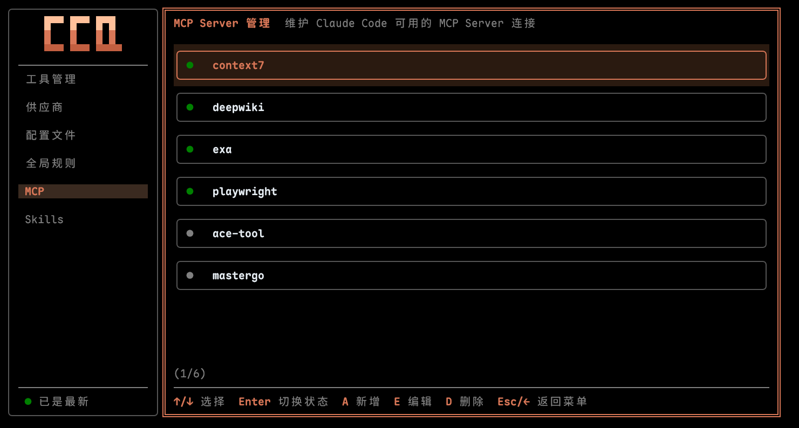
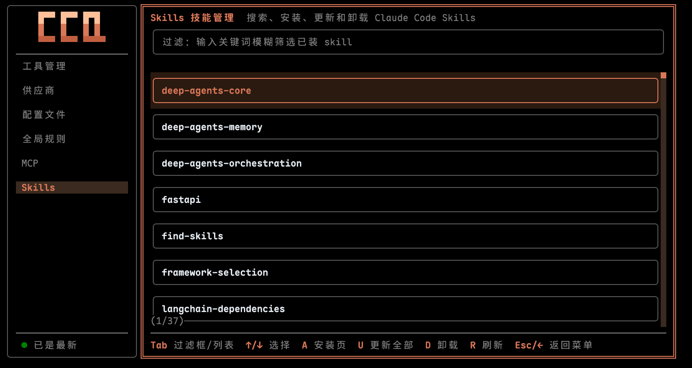

# Claude Code Quickstart (CCQ)

Windows 与 macOS 双平台的 Claude Code 开发环境自动化安装器。

> 目标：把「装环境」变成「跑脚本」——Windows 基于 PowerShell 5.1 单运行时，macOS 基于 Homebrew / zsh / nvm，一条命令装好 Node.js / Git / Claude Code 基础三件套，供应商 / 配置 / MCP / Skills / 工具等统一交给 `ccq` 管理控制台。

---

## 目录

- [为什么用 CCQ](#为什么用-ccq)
- [核心特性](#核心特性)
- [系统要求](#系统要求)
- [快速开始](#快速开始)
  - [方式一：云端直接执行](#方式一云端直接执行推荐)
  - [方式二：下载单文件执行](#方式二下载单文件执行)
  - [方式三：从源码运行](#方式三从源码运行开发者)
- [安装内容](#安装内容)
- [Manage 管理控制台（ccq）](#manage-管理控制台ccq)
- [项目结构](#项目结构)
- [常见问题](#常见问题)
- [License](#license)
- [友情链接](#友情链接)

---

## 为什么用 CCQ

搭 Claude Code 环境，经常会遇到这些问题：

- Windows PowerShell 版本和编码问题
- macOS Homebrew / zsh / nvm 初始化顺序问题
- Node.js / npm / Git / CLI 工具安装顺序复杂
- 第三方供应商配置分散
- MCP Server 凭据重复录入
- 组件升级后配置漂移

CCQ 通过 Windows PS 5.1 单运行时脚本、macOS 原生入口与实时检测机制，把这些问题统一收敛到一个安装/管理入口。

---

## 核心特性

- **双平台入口**：Windows 使用 PS 5.1 单运行时（前置检测内联 + Basic 直装，PS7 作为推荐组件非阻塞安装），macOS 使用 `curl ... | bash` 自动切换 zsh
- **共享契约**：契约按「谁用归谁」拆分——`installer/contracts/`（install 链：步骤/构建/清理）与 `tui/contracts/`（TUI 链：供应商/MCP/ClaudeConfig/模板，**内嵌进 ccq 可执行文件**）
- **实时检测**：每次运行都检测当前状态，已安装组件自动跳过
- **分组安装**：install 专注 Basic 三步（NodeJS / Git / ClaudeCode），工具管理 / 供应商 / 配置文件 / 全局规则 / MCP / Skills 由 `ccq` 管理控制台统一管理
- **单文件可执行 TUI**：OpenTUI + Bun 构建的 `ccq` 可执行文件，通过用户级 PATH 天然可达，提供 6 菜单（工具管理 / 供应商 / 配置文件 / 全局规则 / MCP / Skills）
- **供应商 Profile 化**：供应商配置持久化到 `~/.claude/providers/`
- **MCP 凭据 Vault**：凭据持久化到 `~/.ccq/mcp-meta.json`
- **整可执行文件热更新**：后台检查 GitHub Release 最新版本，强确认下载后原子替换 `~/.local/bin/ccq[.exe]`
- **更新安全机制**：更新前自动快照备份，支持失败后回滚

---

## 系统要求

| 项目 | Windows | macOS |
|---|---|---|
| 操作系统 | Windows 10 1903 (18362)+ / Windows 11 | macOS 12 Monterey 或更新版本 |
| Shell / 运行时 | PowerShell 5.1+ 单运行时直跑（PS7 作为推荐组件非阻塞安装，不 re-exec） | `/bin/zsh`，云端入口兼容 `curl ... | bash` |
| 包管理器 | winget | Homebrew |
| Node.js | 安装脚本自动准备 Node.js LTS | 通过 nvm 官方脚本安装 Node.js LTS |
| 权限 | 管理员权限（建议） | 普通用户即可；Homebrew 安装可能需要用户确认 |
| 网络 | 可访问 GitHub、npm registry | 可访问 GitHub、npm registry、Homebrew 源 |

---

## 快速开始

### 方式一：云端直接执行（推荐）

#### Windows

##### 1) 安装脚本（PS 5.1+）

请先以**管理员身份**打开 Windows PowerShell 5.1 或 PowerShell 7，再执行安装命令：

```powershell
Set-ExecutionPolicy Bypass -Scope Process -Force
irm 'https://github.com/MrNine-666/claude-code-quickstart/releases/latest/download/install.ps1' | iex
```

PS 5.1 单运行时直跑：前置检测内联（Windows 版本 / winget 自动安装 / PS7 非阻塞推荐）+ Basic 三步直装（NodeJS / Git / ClaudeCode），**末尾确认下载 ccq.exe 到 `%USERPROFILE%\.local\bin\` 并加入用户 PATH**。

安装完成后，建议在 Windows Terminal 中将 PowerShell 7 配置为管理员方式打开；后续新开终端执行 `ccq` 进入管理控制台。



##### 2) 管理面板

安装完成后，**开新终端**直接运行：

```powershell
ccq
```

进入 6 菜单管理控制台（工具管理 / 供应商 / 配置文件 / 全局规则 / MCP / Skills）。

#### macOS

首次安装入口（macOS 12+）：

```sh
curl -fsSL "https://github.com/MrNine-666/claude-code-quickstart/releases/latest/download/install.sh" | bash
```



安装完成后，**开新终端**直接运行：

```sh
ccq
```

进入 6 菜单管理控制台。

---

### 方式二：下载单文件执行

从 [Releases](../../releases) 下载：

- Windows: `install.ps1` + `ccq-windows-{x64|arm64}.exe`（2 件）
- macOS: `install.sh` + `ccq-macos-{x64|arm64}`（2 件）

Windows 执行示例：

```powershell
# 安装（PS 5.1+，末尾确认下载 ccq.exe）
Set-ExecutionPolicy -ExecutionPolicy RemoteSigned -Scope CurrentUser -Force
.\install.ps1

# 管理（安装后开新终端）
ccq
```

macOS 执行示例：

```sh
# 安装（末尾确认下载 ccq）
bash ./install.sh

# 管理（安装后开新终端）
ccq
```

---

### 方式三：从源码运行（开发者）

Windows：

```powershell
git clone https://github.com/MrNine-666/claude-code-quickstart.git
cd claude-code-quickstart

# 安装（PS 5.1+）
Set-ExecutionPolicy -ExecutionPolicy RemoteSigned -Scope CurrentUser -Force
pwsh -File installer/windows/Install.ps1

# 管理（从源码运行 TUI）
cd tui
bun run dev
```

macOS：

```sh
git clone https://github.com/MrNine-666/claude-code-quickstart.git
cd claude-code-quickstart

# 安装
zsh installer/macos/Install.zsh

# 管理（从源码运行 TUI）
cd tui
bun run dev
```

模拟 `irm | iex`（可传参，如 `-OutputMode Developer` 全量输出）：

```powershell
pwsh -File installer/build.ps1
& ([scriptblock]::Create((Get-Content "dist/install.ps1" -Raw))) -OutputMode Developer
```

模拟 macOS 构建产物入口：

```sh
sh installer/build.sh
bash dist/install.sh --list-steps
```

---

## 安装内容

### Windows

Windows 入口基于 PowerShell 5.1+ 单运行时执行，安装基础环境并准备 `ccq.exe`：

1. Node.js LTS
2. Git
3. Claude Code
4. `ccq.exe` 管理控制台（下载到 `%USERPROFILE%\.local\bin\` 并加入用户 PATH）

### macOS

macOS 入口从 `curl ... | bash` 启动并切换到 `/bin/zsh`，通过 Homebrew + nvm 准备基础环境与 `ccq`：

1. Homebrew
2. nvm + Node.js LTS
3. Git
4. Claude Code
5. `ccq` 管理控制台（下载到 `~/.local/bin/` 并确保该目录在 PATH）

安装完成后，供应商、配置、全局规则、MCP、Skills、工具等均在 `ccq` 管理控制台操作，详见下节。

---

## Manage 管理控制台（ccq）

安装后直接运行 `ccq` 命令进入管理控制台。`ccq` 是 OpenTUI + Bun 构建的单文件可执行产物（`tui/` 子项目交叉编译而来），安装时下载到 `~/.local/bin/ccq[.exe]`（与 Claude Code native installer 同目录），通过用户级 PATH 天然可达。控制台提供 **6 菜单**：

### 1) 工具管理（Tools）

- ClaudeCode 与 Ccline / CcgWorkflow / OpenSpec / CodexCli / AntigravityCli 全生命周期
- 安装 / 更新 / 卸载（强确认 + snapshot 保护）
- 侧边栏底部「检查更新」按钮可更新 ccq 可执行文件本体



### 2) 供应商（Provider）

- 供应商 Profile 的新增 / 编辑 / 删除 / 切换 / 设置默认
- 支持从 settings.json 同步已有配置
- 内置供应商：智谱 GLM（默认 GLM-5.2）、MiniMax（默认 MiniMax-M3）、Kimi Code（需 `sk-kimi-` 前缀 Key）、DeepSeek（默认 deepseek-v4-pro[1m]）、阿里云百炼（默认 `qwen3.7-plus`）、自定义供应商
- 配置写入 `~/.claude/settings.json` 的 `env`，Profile 保存到 `~/.claude/providers/`



### 3) 配置文件（Config）

- 查看 settings.json 推荐配置（含 description）
- 按缺失项补全（fill-missing）/ 复制 / 外部编辑器编辑



### 4) 全局规则（Prompts）

- 查看推荐 CLAUDE.md / 导入 / 复制 / 外部编辑器编辑



### 5) MCP

- 列表仅展示已安装 Server，行显示状态圆点 + Server ID
- `A` 新增、`E` 编辑（JSON 即真源，内置模板一键带出配置与凭据提示）、`D` 删除
- `Enter` 切换启用 / 禁用状态；凭据持久化到 `~/.ccq/mcp-meta.json`
- 内置 MCP：Context7 / DeepWiki / Tavily / Playwright / Exa Search / ACE Tool / MasterGo / Figma / Chrome DevTools
- 支持 none / single-key / args-token / url-embedded 等凭据类型，新增或编辑时按模板提示填写



### 6) Skills

- 列表页：本地过滤框模糊查询已装 Skills；`u` 更新全部、`d` 卸载单条、`r` 刷新
- 安装页（`a` 进入）：远程搜索框 + 扁平 Skill 列表，`Enter` 触发确认弹窗安装



---

## 项目结构

```text
claude-code-quickstart/
├── dist/                              # 默认构建输出：install.ps1/install.sh + 4 平台 ccq 可执行文件
├── tui/                               # 根级 OpenTUI TUI 子项目（src/ → bun build --compile）
│   ├── contracts/                     # TUI 链契约：claude-config / mcp-servers / providers / templates（内嵌进可执行文件）
│   ├── scripts/                       # 构建 / smoke / parity 验证脚本
│   └── src/                           # 6 菜单管理控制台实现
├── installer/
│   ├── build.ps1                      # Windows / GitHub Actions 构建入口（install.ps1 + Windows ccq）
│   ├── build.sh                       # macOS / Unix 构建入口（install.sh + macOS ccq）
│   ├── contracts/                     # install 链契约：steps / build / cleanup-policy
│   ├── windows/
│   │   ├── Install.ps1                # Windows PS 5.1+ 安装入口（前置检测内联 + Basic 直装 + 末尾下载 ccq.exe）
│   │   ├── core/                      # Windows PowerShell runtime core（含 ccq 可执行文件管理函数）
│   │   └── steps/                     # Windows Basic 步骤实现
│   └── macos/
│       ├── Install.zsh                # macOS 安装入口（前置检测内联 + Basic 直装 + 末尾下载 ccq）
│       ├── core/                      # macOS zsh runtime core（含 ccq 可执行文件管理函数）
│       └── steps/                     # macOS Basic 步骤实现
```

---

## 常见问题

### Q1：安装失败怎么办？

直接重新运行安装脚本即可。CCQ 会实时检测并跳过已安装项。

### Q2：提示找不到 `ccq` 怎么办？

按你的场景处理：

1. **Windows 刚刚执行完 install**
   - `ccq.exe` 已下载到 `%USERPROFILE%\.local\bin\` 并加入用户 PATH，**先新开一个终端**再试：

   ```powershell
   ccq
   ```

   - 如果当前终端也想立即可用，可临时把目录加进当前会话 PATH：

   ```powershell
   $env:Path = "$env:USERPROFILE\.local\bin;$env:Path"
   ccq
   ```

2. **macOS 用户**
   - `ccq` 已下载到 `~/.local/bin/` 并确保该目录在 PATH，**新开 zsh 终端**，或在当前会话临时追加：

   ```sh
   export PATH="$HOME/.local/bin:$PATH"
   ccq
   ```

---

## License

[MIT](LICENSE)

---

## 友情链接

- [LINUX DO](https://linux.do/)

