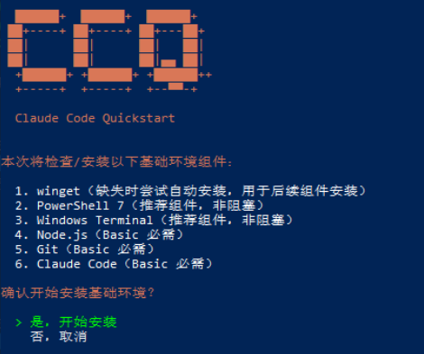
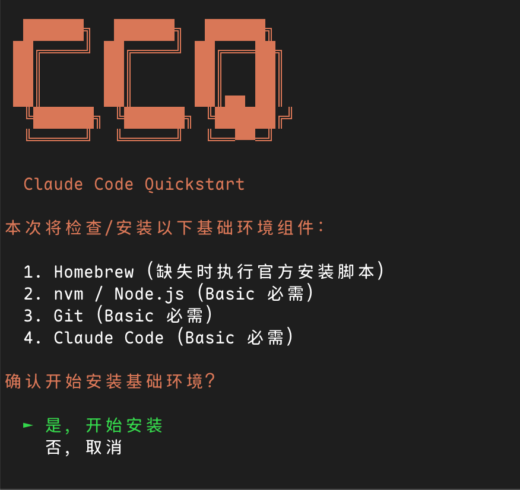
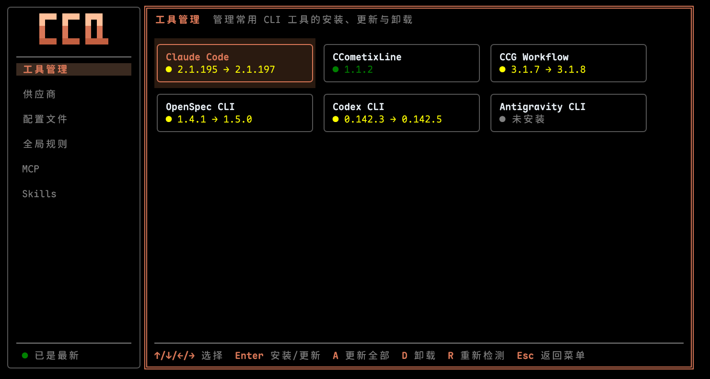
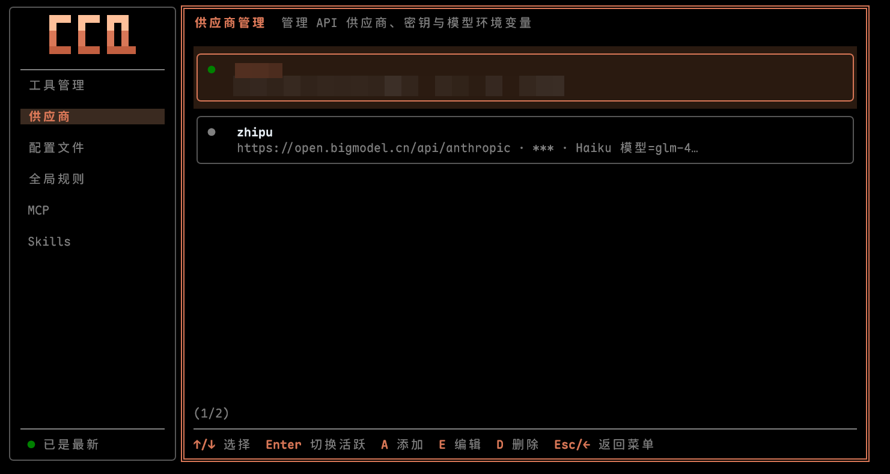
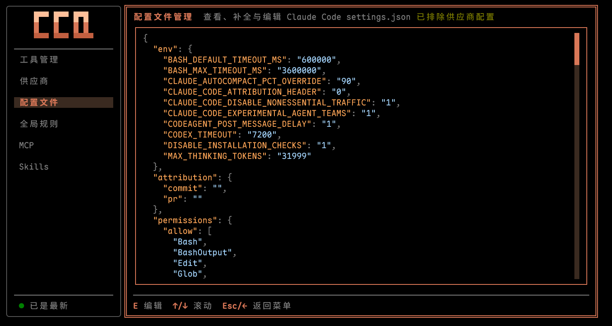
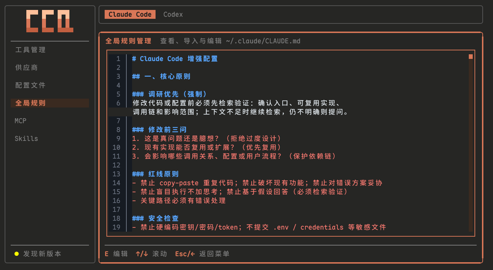
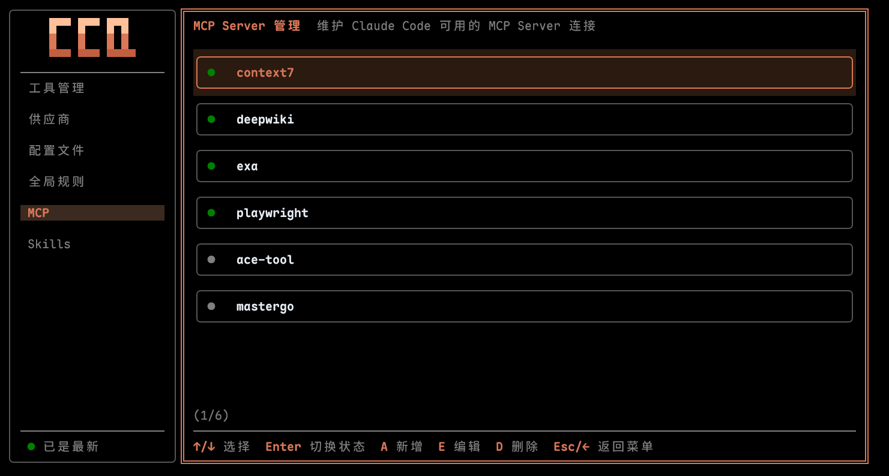
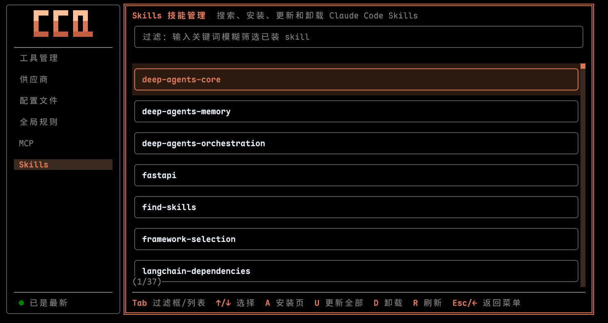
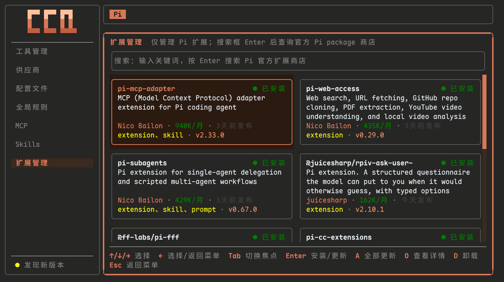
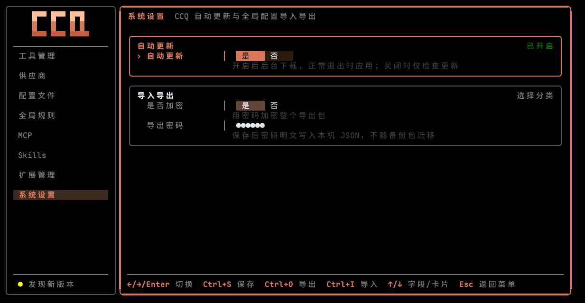

# Claude Code Quickstart (CCQ)

Windows / macOS 上的 CLI Agent 环境安装器 + 管理控制台，支持 Claude Code、Codex、Pi。

一条命令装好 Node.js、Git 和 `ccq`，之后在 `ccq` 里统一管理三个 Agent 的工具、供应商、MCP、Skills 和扩展，预览配置与全局规则，并按分类备份和迁移配置。

---

## 目录

- [它能做什么](#它能做什么)
- [系统要求](#系统要求)
- [安装](#安装)
- [使用 ccq](#使用-ccq)
- [常见问题](#常见问题)

---

## 它能做什么

- **装环境一条命令**：Windows 走 PowerShell，macOS 走 Homebrew / zsh，自动装好 Node.js 和 Git；已经装好的自动跳过，重复执行也不会出错
- **三个 Agent 一个界面**：顶部 Header 切换 Claude Code / Codex / Pi，三套配置互不影响
- **换供应商不碰其它配置**：每个供应商单独一份，切换或设默认只改供应商相关的东西，语言、权限等设置原样保留
- **模型信息自动填**：从上游拉出模型列表，再自动补上上下文窗口、输出上限、价格、思考等级
- **中转不认 Pi 就伪装**：内置 Claude Code / Codex CLI / Gemini CLI 请求头预设，选一下就能以对应客户端身份请求
- **MCP / Skills / 扩展统一维护**：凭据填一次多处复用，装了什么、有没有更新一眼可见
- **配置按需迁移**：按分类导入 / 导出 CCQ、Claude Code、Codex 和 Pi 配置，支持可选加密，不迁移 OAuth 登录态和本机设备标识
- **误删有保护**：卸载、删除与分类覆盖前需要确认；导入默认合并，更新前自动留一份可回滚的备份

---

## 系统要求

|  | Windows | macOS |
|---|---|---|
| 系统 | Windows 10 1903+ / Windows 11 | macOS 12 及以上 |
| 权限 | 建议用管理员 | 普通用户即可 |
| Node.js | 已有达标版本就复用，否则自动装 LTS | 同左 |

网络需要能访问 GitHub 与 npm registry。

---

## 安装

### 方式一 一条命令安装

Windows：以**管理员身份**打开 PowerShell，执行

```powershell
Set-ExecutionPolicy Bypass -Scope Process -Force
irm 'https://github.com/MrNine-666/claude-code-quickstart/releases/latest/download/install.ps1' | iex
```

macOS（12+）：

```sh
curl -fsSL "https://github.com/MrNine-666/claude-code-quickstart/releases/latest/download/install.sh" | bash
```

装完**新开一个终端**，运行 `ccq` 进入控制台。



#### 只装 ccq 控制台（不装 Node.js / Git）

Windows：

```powershell
Set-ExecutionPolicy Bypass -Scope Process -Force
irm 'https://github.com/MrNine-666/claude-code-quickstart/releases/latest/download/download-ccq.ps1' | iex
```

macOS：

```sh
curl -fsSL "https://github.com/MrNine-666/claude-code-quickstart/releases/latest/download/download-ccq.zsh" | zsh
```

这两个入口只装 `ccq` 本体，不装 Node.js、Git 和三个 Agent。



### 方式二 下载脚本执行

从 [Releases](../../releases) 下载对应平台的安装脚本和可执行文件，然后运行：

```powershell
# Windows
Set-ExecutionPolicy -ExecutionPolicy RemoteSigned -Scope CurrentUser -Force
.\install.ps1
```

```sh
# macOS
bash ./install.sh
```

### 方式三 从源码运行（开发者）

```sh
git clone https://github.com/MrNine-666/claude-code-quickstart.git
cd claude-code-quickstart

cd tui
bun install --frozen-lockfile
bun run dev
```

---

安装脚本只负责基础环境和 `ccq` 本体。Claude Code / Codex / Pi 以及周边工具，装完后在 `ccq` 的「工具管理」里按需安装。

---

## 使用 ccq

直接运行 `ccq` 进入控制台。控制台有 8 个页面，常用操作也有命令行命令。

### 常用命令

| 命令 | 说明 |
|---|---|
| `ccq` | 打开控制台 |
| `ccq ls [--tool claude\|codex\|pi]` | 列出供应商，默认 `claude` |
| `ccq use <名字> [--tool claude\|codex]` | 设为默认供应商 |
| `ccq update [--check]` | 检查或更新 `ccq` 本体 |
| `ccq tools update [名字]` | 更新全部工具，或只更新指定工具 |
| `ccq tools uninstall <名字> [-y]` | 卸载工具，默认要 y/N 确认 |
| `ccq uninstall [-y]` | 卸载 `ccq`，默认要 y/N 确认 |

脚本、管道等非交互场景记得加 `--yes` 或 `-y`。

### 八个页面

**1）工具管理**：安装 / 更新 / 卸载 Claude Code、Codex、Pi，以及 Ccline、OpenSpec、Trellis、CodeGraph 等公共工具。侧边栏底部可以更新 `ccq` 自己。



**2）供应商**：给三个 Agent 各配一套供应商。内置智谱 GLM、DeepSeek、Kimi Coding Plan、MiniMax 模板，填个 Key 就能用，也可以自己加。

- **拉模型**：填好地址和 API Key，按 `Ctrl+D` 自动列出可用模型
- **自动补信息**：在模型列表按 `Space`，自动补上上下文窗口、输出上限、价格、思考等级；同名多来源会先给你看摘要，按 `Ctrl+S` 保存
- **配置 Pi 的请求头**：有些中转会认客户端身份，在「请求头」上方左右键选 Claude Code / Codex CLI / Gemini CLI，按 `Enter` 应用即可
- Kimi 两个模板同一端点、同一 Key，只差上下文档位：1M 版需 Allegretto 及以上套餐，256K 版 Moderato 及以上即可，token 消耗约为 1M 版一半



**3）配置文件**：只读预览三个 Agent 的普通配置，按 `O` 使用系统默认应用打开文件编辑。配置页不再提供推荐边栏、补全推荐或 TUI 内编辑入口；供应商、MCP 等字段仍由对应模块管理。



**4）全局规则**：只读预览三个 Agent 的全局规则文件，按 `O` 使用系统默认应用打开编辑，让 Agent 每次对话都遵守你的要求。



**5）MCP**：`A` 新增、`E` 编辑、`D` 删除、`Enter` 启用 / 停用。内置 Context7、DeepWiki、Tavily、Playwright、Exa Search、MasterGo、Figma、Chrome DevTools 等常用 MCP，凭据填一次就存下来。

Pi MCP 使用正式版 **Pi >=1.0.0** 的原生 `~/.pi/agent/mcp.json`，无需安装 adapter 扩展。修改后在 Pi 中运行 `/reload` 或重开会话；需要 OAuth 登录时使用 `pi mcp login`。删除确认会清理三个 Agent 的同名配置和共享定义，包括并非由 CCQ 创建的配置。



**6）Skills**：一眼看到每个 Skill 在 Claude Code / Codex / Pi 里装没装。按 `a` 进安装页可搜索并多选安装；遇到同名不同来源会逐项问你，不会误覆盖。



**7）扩展**：给 Pi 装扩展。空搜索框列出已装的，输入关键词按 `Enter` 搜索官方目录；`Enter` 安装 / 更新，`A` 更新全部，`D` 卸载。卸载只删扩展本身，不动你的设置和凭据。



**8）系统设置**：设置自动更新偏好，并按分类备份 / 迁移配置。

- **导出**：`Ctrl+O` 打开分类选择弹窗，按 `Space` 勾选、方向键折叠 / 展开，`Enter` 选择保存位置，生成 `.ccq-backup` 文件
- **导入**：`Ctrl+I` 选择备份文件，再按分类选择合并 / 覆盖 / 跳过；默认合并，保留备份中未出现的本机内容。覆盖目前仅支持全局规则与 CCQ 自动更新偏好，执行前需要再次确认；其它分类只支持合并 / 跳过
- **自动更新**：默认关闭；开启后启动时静默下载新版，正常退出时应用已验证的更新
- **保存设置**：`Ctrl+S` 保存自动更新、加密选项与备份密码；密码字段聚焦时 `Ctrl+K` 清空草稿，再按 `Ctrl+S` 才会持久清除

**备份安全**：导出默认包含所选分类的 API Key 等文件型凭据，未开启加密时备份为明文，请勿公开分享。开启加密并设置密码后，备份使用 AES-256-GCM 加密。本机保存的备份密码仍以明文存放在 `~/.ccq/system-settings.json`；能读取该文件的人或程序，可能用它解密备份。OAuth 登录态、设备标识、本机备份密码与加密偏好不迁移；新电脑的 OAuth 登录仍需重新完成。



### 临时指定供应商

`ccq` 只管配置，不接管 Agent 进程。临时换供应商直接调底层命令：

```powershell
claude --settings ~/.claude/providers/custom.json
codex --profile custom
pi --provider custom --model model-id
```

参数可以直接追加，例如 `codex --profile custom -m gpt-5`。要长期生效，Claude Code / Codex 用 `ccq use custom --tool claude`、`ccq use custom --tool codex`；Pi 在「配置文件」页按 `O` 外部打开 `settings.json`，修改 `defaultProvider`。

---

## 常见问题

**安装失败了怎么办？**

重新跑一遍安装脚本就行。已经装好的会自动跳过，重复执行是安全的。

**找不到 `ccq` 命令？**

先新开一个终端。还不行就在当前终端临时补一下 PATH：

```powershell
# Windows
$env:Path = "$env:USERPROFILE\.local\bin;$env:Path"
```

```sh
# macOS
export PATH="$HOME/.local/bin:$PATH"
```

**怎么卸载？**

`ccq uninstall` 卸掉控制台本体，或在「工具管理」里逐个卸载工具。卸载不会动你已有的配置和用户数据。

---

## 许可证

[MIT](LICENSE)

---

## 相关链接

- [LINUX DO](https://linux.do/)
